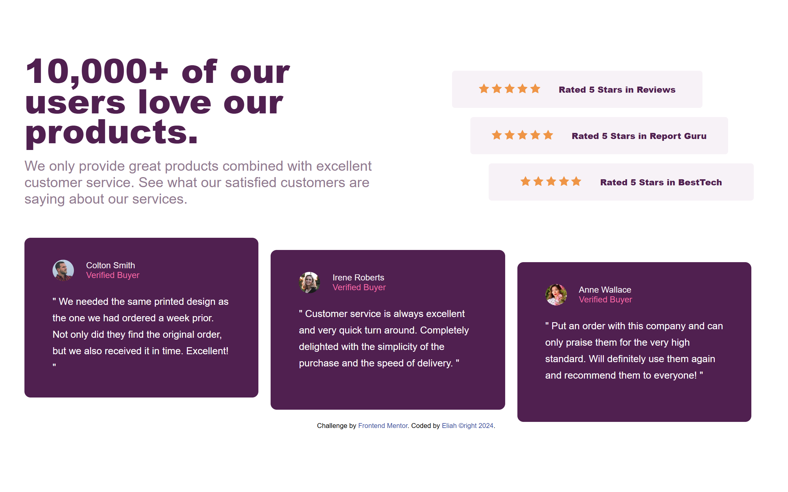
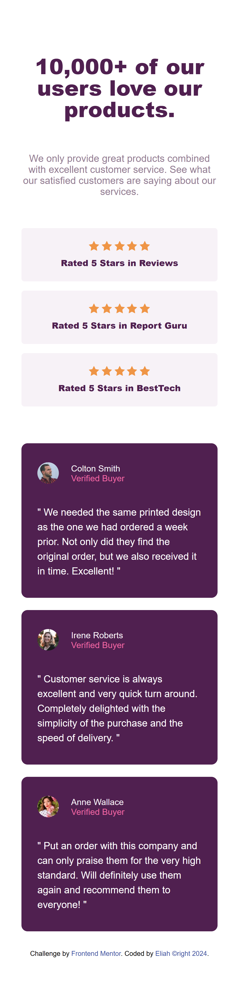

# Frontend Mentor - Social proof section solution

This is a solution to the [Social proof section challenge on Frontend Mentor](https://www.frontendmentor.io/challenges/social-proof-section-6e0qTv_bA). Frontend Mentor challenges help you improve your coding skills by building realistic projects. 

### The challenge

Users should be able to:

- View the optimal layout for the section depending on their device's screen size

### Screenshot

, 

### Links

- Solution URL: [Solution URL](http://127.0.0.1:5500/social-proof-section-master/social-proof.html)
- Live Site URL: [Add live site URL here](https://your-live-site-url.com)

## My process

### Built with

- Semantic HTML5 markup
- Flexbox
- CSS Grid

### Continued development

In the meantime, I will build this project using TailwindCSS.

## Author

- Website - [Okedo01](https://github.com/okedo01)
- Frontend Mentor - [@yourusername](https://www.frontendmentor.io/profile/yourusername)